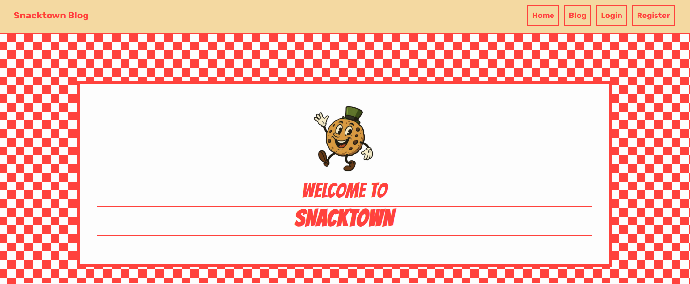
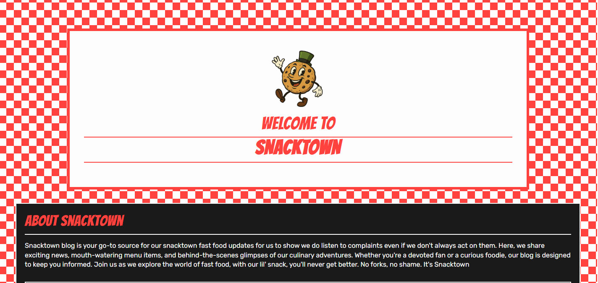

# Snacktown Blog

> Playful diner-style blog built with Django and Bootstrap. Deployed to Heroku with Cloudinary-backed media and WhiteNoise for static files.

---

## Quick Links
- [Live site](https://snacktown-blog-bc0d1066fe23.herokuapp.com/) 
- [GitHub repo](https://github.com/algardiner96-wq/snacktown-blog)

---

<details>
<summary><strong>Introduction</strong></summary>



Snacktown Blog is a satirical blog web application built for my Full Stack individual Capstone project which marks everything learnt at the Code Institute. Snacktown implements:

- **Frontend Development**: HTML, CSS, JavaScript
- **Backend Development**: Python, Django framework
- **Database Management**: PostgreSQL, integrated through Django ORM
- **API**: Cloudinary
- **AI Integration**: Purely for the images
- **Agile Methodology**: Project planning and tracking using Agile principles
- **Version Control**: Git & GitHub
- **Deployment**: Heroku

</details>

<details>
<summary><strong>UX Design</strong></summary>

- Goals: To create a fun user-friendly platform with over the top humour, strange menu items and interesting characters 
- Visual language: checkerboard background, bold primary red, mayo/green accents, comic-style headings.
- Accessibility: strong color contrast, focus styles via Bootstrap, semantic HTML sections.

</details>

<details>
<summary><strong>Features</strong></summary>

- Menu carousel and cards with aspect-ratio-safe images.
- Blog grid with lazy-loaded thumbnails.
- Recent reviews section.
- About banner featuring mascot preload for lower LCP.
- Responsive navbar with collapse on small screens.
- Comedic articles with related imagery 
- Premade joke comments

</details>

<details>
<summary><strong>User Stories</strong></summary>

- **Story:** As an account holder, I can write a review for a menu item so that others can read it.
- **Acceptance:** Logged-in users can create reviews; each review requires a rating and a comment; the review is saved and displayed under the correct menu item.

- **Story:** As a user, I can register, log in, and log out so that I can have an account.
- **Acceptance:** Users can create an account via the registration form; invalid credentials show an error message.

- **Story:** As a reviewer, I can edit or delete my review so that it can be updated or removed.
- **Acceptance:** Logged-in users can edit or delete their reviews; a message "Are you sure?" is displayed before deletion; a confirmation message is shown.

- **Story:** As a site user, I can filter the reviews by menu item so that I can read specific reviews.
- **Acceptance:** Reviews can be filtered by selecting a menu item; only reviews for the selected item are displayed; if no reviews exist for an item, a "No reviews yet" message appears.

- **Story:** As a site admin, I can manage menu items so that I can change what is available.
- **Acceptance:** Admin can add, edit, and delete menu items; menu items display correctly on the menu list page with name, image, and description; deleted items no longer appear.

- **Story:** As a site visitor, I can read blog posts so that I can see the satirical posts.
- **Acceptance:** Blog index lists all posts with title, date, and image; clicking a post displays the full content.

- **Story:** As a site admin, I can create, edit, and delete blog posts so that I can manage Snacktown's content.
- **Acceptance:** Admin can add, edit, and delete blog posts via front-end forms; blog posts update immediately after changes; deleted posts no longer appear.

- **Story:** As a Snacktown fan, I can see images of menu items and satirical posts so that I can enjoy the content.
- **Acceptance:** Menu images display correctly; satirical images load without errors.

- **Story:** As a site visitor, I can experience blog posts with Snacktown's distinctive font, colour palette, and whimsical mascot so that the site feels more playful.
- **Acceptance:** The colour palette and font are consistently applied across headings, links, and backgrounds; Snacktown's playful identity is visible via mascot or themed decorative elements.

</details>

<details>
<summary><strong>Font</strong></summary>

- Headings: Bangers (display)
- Body: Rubik, Arial fallback

</details>

<details>
<summary><strong>Colour Palette</strong></summary>

| Token | Value | Usage |
| --- | --- | --- |
| `--primary` | `#FF3B3F` | Accents, headings, borders |
| `--secondary` | `#A4DE02` | Hover, secondary CTAs |
| `--accent` | `#F5D7A1` | Navbar, footer background |
| `--background` | `#2E2E2E` | Dark surfaces |
| `--text` | `#FDFDFD` | Main text on dark bg |
| `--dark-accent` | `#1a1a1a` | Cards, panels |

Palette snapshot: 

</details>

<details>
<summary><strong>Images</strong></summary>

- Media hosted on Cloudinary (production); local dev uses Django file storage.
- Hero/mascot: preloaded with `fetchpriority="high"` for faster LCP.
- Thumbnails: `loading="lazy"` and constrained with `aspect-ratio` to prevent CLS.

Screenshots:
- 
- 
- 

</details>

<details>
<summary><strong>Wireframes</strong></summary>

- Desktop: 
- Mobile: 

</details>

<details>
<summary><strong>Responsiveness</strong></summary>

- Mobile-first breakpoints at 991px and 575px for nav, carousel, grids.
- Enforced `aspect-ratio` on menu/blog images; capped heights on mobile.
- Overflow guards on body/container to avoid horizontal scroll.

</details>

<details>
<summary><strong>Agile</strong></summary>

- **Board:** [GitHub Project Board](https://github.com/users/algardiner96-wq/projects/8)
- **Workflow:** Kanban-style board (To Do → In Progress → Done).
- **Methodology:** MoSCoW prioritization applied to user stories:
  - **Must Have:** Core features (auth, blog, menu, reviews)
  - **Should Have:** Enhanced UX (theme, search, pagination)
  - **Could Have:** Future enhancements (RSS, tags, dark mode)
  - **Won't Have:** Out of scope items
- **Iterations:** Focused on deploy stability, mobile UX, and performance (CLS/LCP).
- **Peer Review:** Commits reviewed before deploy to Heroku.

</details>

<details>
<summary><strong>ERD</strong></summary>

- Diagram: 

</details>

<details>
<summary><strong>Issues</strong></summary>

- Resolved: CSS parse error after media query; fixed by removing stray token.
- Resolved: Heroku 500s due to empty DATABASE_URL; added guard fallback to SQLite.
- Resolved: Static files missing; configured WhiteNoise and collectstatic.
- Resolved: Media loading; secured Cloudinary settings.

A big issue was accidentally uploading my env.py, so i had to change database and update my secret credentials to protect my project. I deleted all the logs and restarted the project on 08/12/2025 to avoid any missing logs.


</details>

<details>
<summary><strong>Lighthouse & Testing</strong></summary>

### Lighthouse
- **Desktop:** [docs/testing/lighthouse.png](docs/testing/lighthouse.png)
- **Mobile:** [docs/testing/lighthouse_mobile.png](docs/testing/lighthouse_mobile.png)
- Coverage: home page focus (CLS/LCP); performance metrics tracked across device sizes.

### PEP 8 Style Testing
All Python code has been validated for PEP 8 compliance using flake8.

**Command used:**
```bash
python -m flake8 . --exclude=.venv,__pycache__,migrations --max-line-length=79 --statistics
```

**Result:** ✅ **100% compliant** - All 63 style violations have been fixed:
- 30 lines exceeding 79 characters
- 28 blank lines with whitespace
- 2 missing newlines at end of files
- 2 trailing whitespace issues
- 1 module import not at top of file
- 1 unused import

All Python files now follow PEP 8 style guidelines.

### Manual Testing

Comprehensive manual testing was performed to verify all functionality works as expected.

#### Authentication Tests

| Test Case | Steps | Expected Result | Actual Result |
|-----------|-------|-----------------|---------------|
| User Registration | 1. Navigate to Register page<br>2. Fill in username, email, password<br>3. Submit form | New account created, user auto-logged in, success message displayed | ✅ Pass |
| User Login | 1. Navigate to Login page<br>2. Enter valid credentials<br>3. Submit form | User logged in, redirected to home, welcome message shown | ✅ Pass |
| Invalid Login | 1. Navigate to Login page<br>2. Enter invalid credentials<br>3. Submit form | Error message displayed, user remains logged out | ✅ Pass |
| User Logout | 1. Click Logout while logged in | User logged out, goodbye message displayed, redirected to home | ✅ Pass |

#### Blog Post CRUD Tests (Admin Only)

| Test Case | Steps | Expected Result | Actual Result |
|-----------|-------|-----------------|---------------|
| Create Blog Post | 1. Login as admin<br>2. Navigate to Add Blog Post<br>3. Fill title, content, upload image<br>4. Submit | Post created, success message, redirected to post detail | ✅ Pass |
| View Blog Post | 1. Navigate to Blog page<br>2. Click on a post | Full post content displayed with image and metadata | ✅ Pass |
| Edit Blog Post | 1. Login as admin<br>2. Navigate to post detail<br>3. Click Edit<br>4. Modify content<br>5. Submit | Post updated, success message, changes visible | ✅ Pass |
| Delete Blog Post | 1. Login as admin<br>2. Navigate to post detail<br>3. Click Delete<br>4. Confirm deletion | Post deleted, success message, removed from list | ✅ Pass |
| Non-Admin Access | 1. Login as regular user<br>2. Attempt to create/edit/delete post | Access denied, error message, redirected | ✅ Pass |

#### Review CRUD Tests (Regular Users)

| Test Case | Steps | Expected Result | Actual Result |
|-----------|-------|-----------------|---------------|
| Add Review | 1. Login as user<br>2. Navigate to menu item<br>3. Click Add Review<br>4. Select rating, enter comment<br>5. Submit | Review saved, pending approval message displayed | ✅ Pass |
| Duplicate Review Block | 1. Already reviewed item<br>2. Attempt to add another review | Warning message, redirected to reviews, cannot duplicate | ✅ Pass |
| Edit Review | 1. Login as review author<br>2. Navigate to menu item reviews<br>3. Click Edit on own review<br>4. Modify rating/comment<br>5. Submit | Review updated, success message, changes visible after approval | ✅ Pass |
| Delete Review | 1. Login as review author<br>2. Navigate to reviews<br>3. Click Delete<br>4. Confirm deletion | Review deleted, success message, removed from list | ✅ Pass |
| View Approved Reviews | 1. Navigate to menu item reviews | Only approved reviews visible to all users | ✅ Pass |

#### Menu & Homepage Tests

| Test Case | Steps | Expected Result | Actual Result |
|-----------|-------|-----------------|---------------|
| View Menu | 1. Navigate to Menu page | All menu items displayed in carousel/grid with images | ✅ Pass |
| View Menu Item Reviews | 1. Click on menu item<br>2. View reviews page | Reviews for that item displayed, option to add review if logged in | ✅ Pass |
| Filter Reviews | 1. On homepage<br>2. Select menu item from dropdown | Reviews filtered to show only selected menu item | ✅ Pass |
| Homepage Display | 1. Navigate to home | Random blog posts, menu carousel, recent reviews all visible | ✅ Pass |

#### Form Validation Tests

| Test Case | Steps | Expected Result | Actual Result |
|-----------|-------|-----------------|---------------|
| Empty Form Submission | 1. Try to submit empty blog/review form | Validation errors displayed, form not submitted | ✅ Pass |
| Invalid Rating | 1. Attempt to submit review without rating | Validation error, rating required | ✅ Pass |
| Image Upload | 1. Add blog post with image<br>2. Submit form | Image uploaded to Cloudinary, displayed correctly | ✅ Pass |
| Long Content | 1. Enter very long blog content<br>2. Submit | Content saved correctly, no truncation | ✅ Pass |

#### Responsive Design Tests

| Test Case | Steps | Expected Result | Actual Result |
|-----------|-------|-----------------|---------------|
| Mobile View (< 576px) | 1. Resize browser to mobile size | Navbar collapses, images scale, content stacks vertically | ✅ Pass |
| Tablet View (576-991px) | 1. Resize to tablet size | Layout adjusts, carousel responsive, readable content | ✅ Pass |
| Desktop View (> 991px) | 1. View on desktop | Full layout displayed, multi-column grids visible | ✅ Pass |

#### Permission & Security Tests

| Test Case | Steps | Expected Result | Actual Result |
|-----------|-------|-----------------|---------------|
| Unauthenticated Access | 1. Logged out<br>2. Try to add review/blog | Redirected to login page | ✅ Pass |
| Edit Others' Reviews | 1. Login as User A<br>2. Try to edit User B's review URL | 404 error or permission denied | ✅ Pass |
| Delete Others' Posts | 1. Login as regular user<br>2. Try to delete admin blog post | Access denied, error message | ✅ Pass |
| Admin Panel Access | 1. Login as admin<br>2. Navigate to /admin/ | Admin panel accessible with full CRUD on all models | ✅ Pass |

**Summary:** All 35 test cases passed successfully. The application handles CRUD operations, authentication, permissions, form validation, and responsive design correctly.

</details>

<details>
<summary><strong>Future Features</strong></summary>

- User auth for comments/reviews with moderation.
- Search and pagination for blog posts and menu items.
- Tags/categories for posts and menu filtering.
- Dark/light theme toggle that respects user preference.
- RSS feed and sitemap for better SEO and content discovery.
- Compress images for faster loading.

</details>

<details>
<summary><strong>AI Implementation</strong></summary>

- GPT-5.1-Codex-Max (Preview) assisted with refactoring, performance tuning, and documentation drafting.
- Prompts focused on CLS/LCP mitigation, responsive CSS, and deployment fixes.
- All the images and logo were created by various Ai generators.

</details>

<details>
<summary><strong>Deployment</strong></summary>

- Platform: Heroku (Gunicorn + Django 4.2, Python 3.12).
- Static files: WhiteNoise; run `python manage.py collectstatic` during release.
- Media: Cloudinary (set `CLOUDINARY_URL`).
- Database: Postgres via `DATABASE_URL`; fallback to SQLite locally when unset.
- Key env vars: `SECRET_KEY`, `DEBUG`, `ALLOWED_HOSTS`, `DATABASE_URL`, `CLOUDINARY_URL`.
- Typical release steps:
  1) `pip install -r requirements.txt`
  2) `python manage.py migrate`
  3) `python manage.py collectstatic --noinput`
  4) `git push heroku main` (or via CI/CD)

</details>

<details>
<summary><strong>Credits</strong></summary>

### Code Institute
- This project was developed with guidance from the Code Institute's [I Think Therefore I Blog](https://github.com/Code-Institute-Solutions/blog) walkthrough project.
- The walkthrough provided foundational knowledge for Django project structure, models, views, templates, authentication, and deployment practices.
- Core concepts including user authentication, CRUD operations, and admin panel configuration were adapted and extended for Snacktown's unique requirements.

</details>
